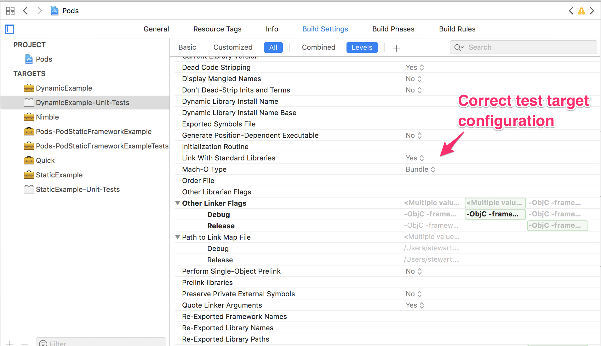
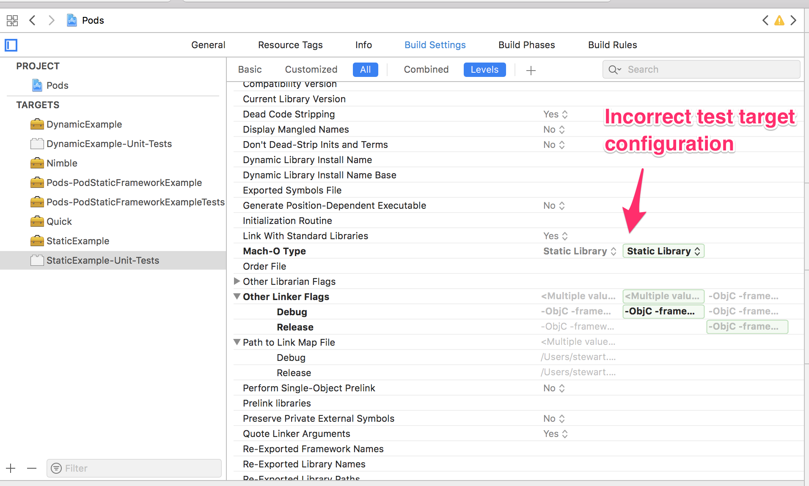
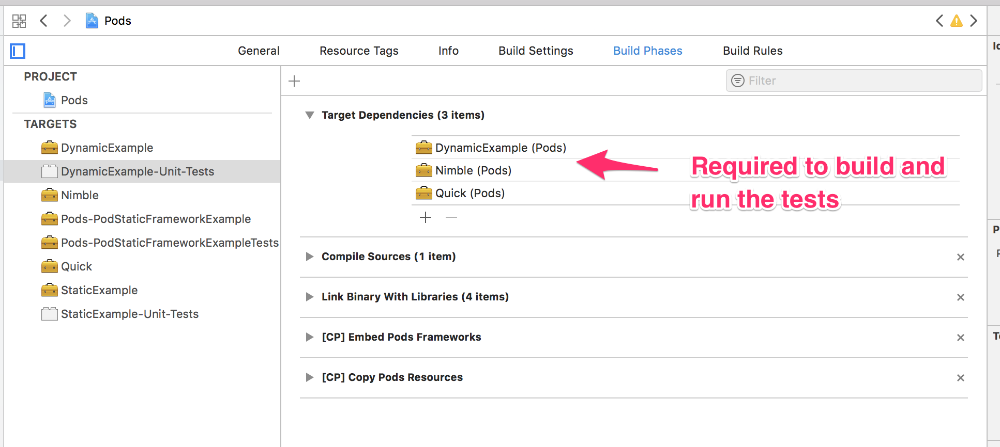
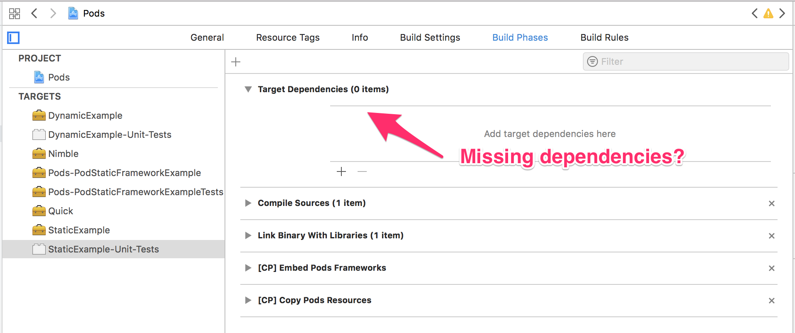

# PodStaticFrameworkExample

Example project to investigate an issue with Cocoapods static frameworks & test bundles

## Background

The project contains a consuming sample application, `PodStaticFrameworkExample`, with 2 dependencies. A dynamic framework, `DynamicExample` and a static framework `StaticExample`, which both just provide a simple adding function for demonstration purposes.

The project uses [Cocoapods test specificications](http://blog.cocoapods.org/CocoaPods-1.3.0/) that came in the v1.3.0 release.


## Hierarchy

```
.
├── DynamicExample
│   ├── DynamicExample
│   │   └── Classes
│   │       └── DynamicAdder.swift
│   ├── DynamicExample.podspec
│   ├── Example
│   │   ├── DynamicExample
│   │   │   └── ... demo app code ...
│   │   ├── Podfile
│   │   ├── Podfile.lock
│   │   └── Tests
│   │       └── DynamicAdderSpec.swift
├── PodStaticFrameworkExample
│   ├── PodStaticFrameworkExample
│   │   └── ... demo app code ...
│   └── PodStaticFrameworkExampleTests
│       └── ExampleSpec.swift
├── Podfile
├── Podfile.lock
└── StaticExample
    ├── Example
    │   ├── Podfile
    │   ├── Podfile.lock
    │   ├── StaticExample
    │   │   └── ... demo app code ...
    │   └── Tests
    │       └── StaticAdderSpec.swift
    ├── StaticExample
    │   └── Classes
    │       └── StaticAdder.swift
    └── StaticExample.podspec
```


## The problem

The test specs are integrated into the main app using the new mechanism:

```
  pod 'DynamicExample', :path => './DynamicExample', :testspecs => ['Tests']
  pod 'StaticExample', :path => './StaticExample', :testspecs => ['Tests']
```

The dynamic framework tests work fine, but the static framework tests do not. When trying to run, I get this error in the Xcode build output:

```
Test target StaticExample-Unit-Tests encountered an error (Early unexpected exit, operation never finished bootstrapping - no restart will be attempted)
```

It seems this is because cocoapods is setting up the unit test bundle to be a static library, Xcode doesn't know how to inject and run it like it usually would a `.xctest` bundle. eg. the dynamic framework unit test bundle defaults to a normal bundle type:



but the equivalent for the static framework is defaulting to being a static library, even though the target is a unit test bundle (inheriting the static flag?)




## Work around 1

To get around the unit test bundle, given this is rare, we can use a post install hook to specifically set it back to being a bundle:

```
post_install do |installer|
  installer.pods_project.targets.each do |target|
    if target.name == 'StaticExample-Unit-Tests'
      target.build_configurations.each do |config|
        config.build_settings['MACH_O_TYPE'] = 'mh_bundle'
      end
    end
  end
end
```

## Work around 2

Even with (1), it seems the dependencies for the target are wrong, so a clean build may not work (like we do in CI). For example, the dependencies for the dynamic framework's unit test bundle looks like this:



... but for the equivalent target for the static library, it's empty.



Manually adding the target dependencies _works_, but it's overwritten each time `pod install` is run, so it's not sustainable.
